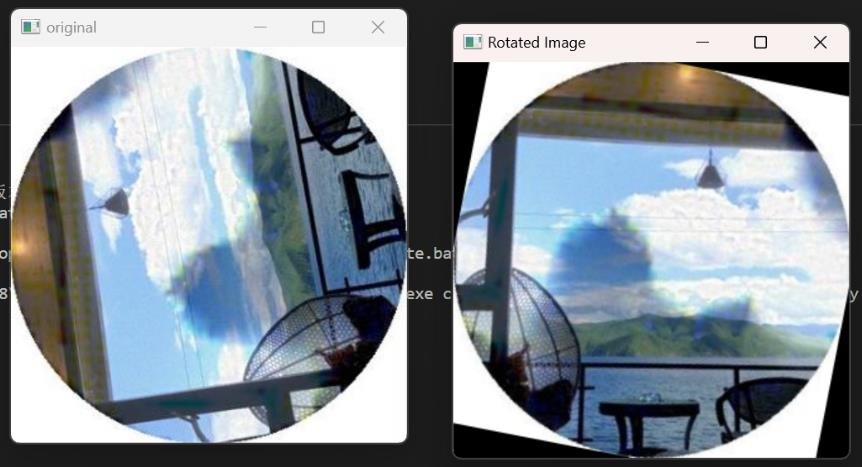

### 1. 需要把正常角度的图片保存在imgs目录下面
### 2. 运行train.py进行训练
### 3. 运行test.py调用模型

训练好的模型 [下面这个训练好的模型只能识别百度旋转的图片，不要用其他图片测试，直接用百度旋转的图片测试]
链接：https://pan.baidu.com/s/1mcz58nquhL0DA8tCX5f_ww 
提取码：39ev 

### 注意: 需要设置训练轮数  epochs
### 导入图片大小最好要为正方形，不为正方形也可以训练
 
